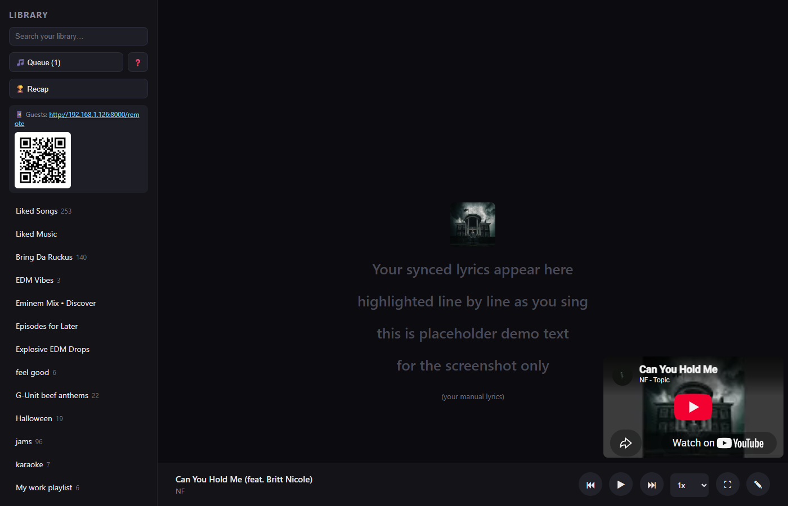
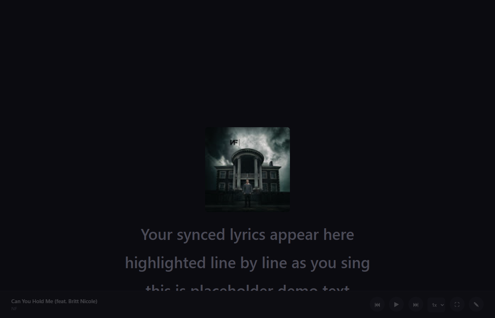
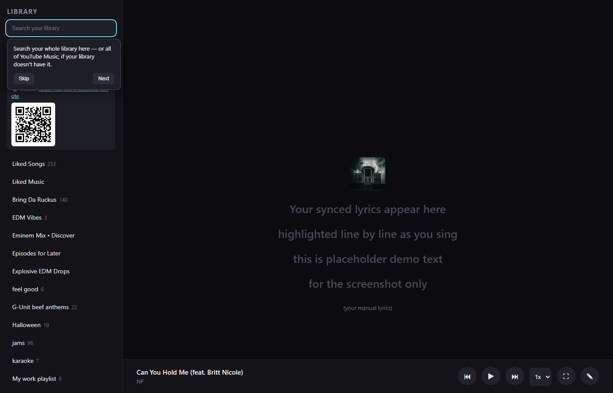
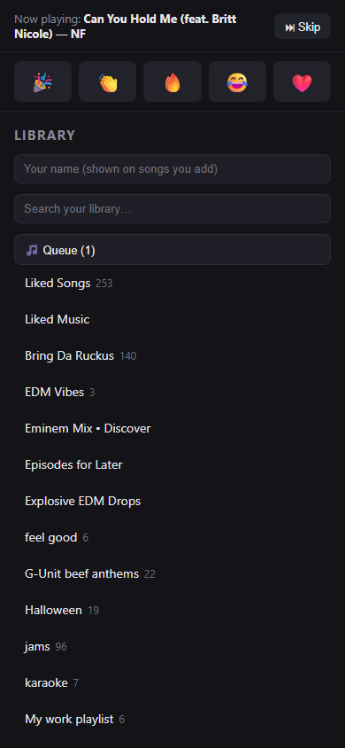

# YT Music Karaoke

[](https://github.com/Revg1794/YT-Music-Karaoke/actions/workflows/tests.yml)

A local karaoke-style player for your YouTube Music library: browse your playlists/liked
songs, play tracks through the official YouTube embedded player, and see big auto-scrolling
synced lyrics (from [LRCLIB](https://lrclib.net)) — the "TV cast" experience, on your PC.

Personal-use only: it authenticates as *you* via cookies from your own logged-in browser
session (using [ytmusicapi](https://github.com/sigma67/ytmusicapi), an unofficial library),
and is not meant to be exposed to the internet or other users.

## Screenshots

| Main view | TV mode |
|---|---|
|  |  |

| First-run tour | Phone remote (party mode) |
|---|---|
|  |  |

(The lyrics shown above are placeholder demo text, not real song lyrics.)

## Getting the code (new to Git? read this)

You don't need to know Git at all to just try the app once:

1. Click the green **`<> Code`** button at the top of this GitHub page.
2. Click **Download ZIP**.
3. Extract the ZIP anywhere (e.g. `Documents\YT-Music-Karaoke`).
4. Continue with **Quick start** below.

If you'd rather use Git (recommended if you want to easily grab future updates instead of
re-downloading a ZIP each time):

1. Install [Git for Windows](https://git-scm.com/download/win) if you don't already have it.
2. Open a terminal in the folder where you want the project to live, and run:
   ```
   git clone https://github.com/Revg1794/YT-Music-Karaoke.git
   ```
   This creates a `YT-Music-Karaoke` folder containing the full project.
3. Whenever you want to grab the latest changes later, open a terminal *inside* that folder
   and run:
   ```
   git pull
   ```

A few terms, if they're unfamiliar:
- **Repository ("repo")** — the project's folder, plus its full saved history.
- **Commit** — a saved snapshot of changes, with a short message describing them.
- **Push** — send your local commits up to GitHub.
- **Pull** — download commits from GitHub into your local copy.
- **Remote / origin** — the GitHub copy your local folder is linked to.

Two errors you might hit if you go on to make your own commits:
- `fatal: not a git repository` — you ran a git command outside the project folder. `cd` into
  it first (e.g. `cd F:\Projects\YT-Music-Karaoke`).
- `Please tell me who you are` — one-time setup Git needs before it will let you commit:
  ```
  git config --global user.name "Your Name"
  git config --global user.email "you@example.com"
  ```

## Quick start

1. Make sure [Python 3.10+](https://python.org) and [Google Chrome](https://www.google.com/chrome/)
   are installed.
2. Double-click **`run.bat`**.

That's it. On first run it creates a virtual environment, installs dependencies, and opens a
real Chrome window pointed at YouTube Music — log in there normally, then switch back to the
terminal window and press Enter. It writes `browser.json` (your local auth file — **never
commit or share this file**, it's equivalent to a login session; it's already in
`.gitignore`) and starts the app, opening **http://localhost:8000** automatically. Every run
after that just starts the server directly.

Pick a playlist or Liked Songs from the sidebar, click a track, and the lyrics panel syncs as
it plays. Audio plays through your system's default output device (your PC speakers).

If your session eventually expires and library calls start failing, just delete
`browser.json` and run `run.bat` again to reconnect your account.

### Keyboard shortcuts

| Key | Does |
|---|---|
| `Space` | Play / pause |
| `←` / `→` | Previous / next track |
| `F` | TV mode (fullscreen big lyrics) |
| `[` / `]` | Nudge lyric timing 100ms earlier / later |
| `0` | Reset this track's lyric timing |

The `⟳` button beside the queue button re-scans your YouTube Music library, for songs you've
saved since the server started.

### Lyrics running early or late?

LRCLIB timings were matched against whatever copy of the song that contributor had, which isn't
always the one YouTube serves — so a track can be consistently off by a few hundred
milliseconds. Nudge it with `[` and `]` while it plays; the correction is remembered per song
(in `lyric_offsets.json`, gitignored) and reapplied every time that track comes up. `0` clears
it. The current offset shows next to the player controls whenever it isn't zero.

## Party mode (queue from a phone)

The app is also reachable from other devices on your WiFi. The sidebar shows a **"📱 Guests"**
link (with a scannable QR code) to a URL like `http://<your-PC's-IP>:8000/remote` — open that
on a phone (same WiFi network) to browse the library and add songs to the shared queue, without
needing to touch the host PC. The `/remote` page is queue-management only (no player/lyrics) —
playback always stays on the main page, so you don't get multiple devices trying to play audio
at once.

**Guests can add songs and send reactions — nothing else.** Skipping, removing, reordering and
clearing are host-only, so nobody can cut the current singer off from the back of the room. The
host page unlocks those automatically when it's running on the same machine as the server; on
any other screen (a TV browser on the LAN, say) it asks once for the **host PIN**, printed in
the server console window at startup.

Guests can type their name on the remote page (remembered on their phone) so the queue shows
who added what, and reactions show who sent them. Search also falls back to live YouTube Music
catalog results (not just your saved library) when your library has few matches — so guests can
request almost anything, not just what you've already saved.

### Fair rotation

With **🔁 Fair rotation** on (the default, toggled in the queue view), a request is slotted in
by whose turn it is rather than simply appended: someone's second song waits until everyone
else has had a first. One enthusiastic guest queueing five songs in a row no longer locks out
the rest of the room. Whoever is currently singing counts as having just had their turn, so a
newcomer's first song goes ahead of the current singer's next one. Turn it off for plain
first-in, first-out order. Auto-radio filler is always appended and never takes a turn.

The queue is shared and persisted server-side (`queue_state.json`, gitignored) — refreshing the
page, or even restarting the server, restores it.

The first time you run this, **Windows Firewall will likely prompt** to allow Python through
the firewall — approve it for **Private networks**. This only works on the same WiFi/LAN, not
over the internet.

## Manual setup (if you'd rather not use run.bat)

```
python -m venv .venv
.venv\Scripts\pip install -r backend\requirements.txt
.venv\Scripts\python.exe setup_auth.py
.venv\Scripts\uvicorn main:app --app-dir backend --port 8000
```

`setup_auth.py` is the same login flow `run.bat` triggers automatically — it drives a real
Chrome window via [Playwright](https://playwright.dev) so you can log in normally, then reads
the session cookies straight out of that browser to build `browser.json`. No DevTools, no
copying headers by hand.

### Fallback: manual DevTools auth

`setup_auth.py` needs Chrome installed and a normal interactive login. If that's not possible
in your environment, `regenerate_auth.py` is a manual fallback that builds `browser.json` from
headers you copy out of Chrome DevTools yourself:

- Open [music.youtube.com](https://music.youtube.com), logged in, DevTools (F12) →
  **Network** tab → filter to **Fetch/XHR**.
- Click around (open a playlist, Library, etc.) until you see a `browse?prettyPrint=false`
  request (POST, to `music.youtube.com`).
- Right-click it → **Copy** → **Copy as cURL (bash)**. Paste into a new file
  `curl_headers.txt` in the project root.
- Click that same request → **Cookies** tab (next to Headers/Payload/Timing). Click the first
  row, Shift+click the last row, Ctrl+C. Paste into `cookies.txt` in the project root. (Chrome
  deliberately omits the `Cookie` header from every code-export format, so it has to come from
  this separate tab.)
- Run:
  ```
  .venv\Scripts\python.exe regenerate_auth.py curl_headers.txt cookies.txt
  ```
- Delete `curl_headers.txt` and `cookies.txt` afterwards — they contain the same sensitive
  session data and aren't needed once `browser.json` exists.
- **Never paste header/cookie content into a chat/AI assistant** — treat it like a password.
  Everything above should stay local to your machine.

## Troubleshooting / FAQ

**`run.bat` says "Python was not found on your PATH."**
Install Python from [python.org](https://python.org) and make sure you check "Add python.exe
to PATH" during install (it's unchecked by default). Then run `run.bat` again.

**Windows Firewall popped up asking to allow Python — is that safe to approve?**
Yes. It's asking because the server binds to your whole network (so `/remote` works on phones),
not just this PC. Approve it for **Private networks**; you don't need Public.

**A Chrome window opened for login but it says "browser is deprecated" or looks broken.**
This shouldn't happen with the current `setup_auth.py` (it drives your real installed Chrome),
but if you see it, make sure Chrome itself is up to date. If `setup_auth.py` can't find Chrome
at all, it'll tell you to install it from google.com/chrome — Playwright needs the real browser,
not just any browser.

**Setup asked me to verify it's really me (2FA / "is this you?") even though I'm already
logged into Chrome elsewhere.**
Expected — `setup_auth.py` opens a fresh, isolated browser profile each time (not your everyday
one), so Google treats it as a new device. Not a bug.

**Guests can't reach the `/remote` link on their phone.**
Check they're on the **same WiFi network** as the host PC — this only works on your local
network, not the internet. If they still can't connect, double-check the Windows Firewall
prompt above was approved (declining it silently blocks other devices).

**`git commit` says "Please tell me who you are."**
See the one-time `git config` setup in **Getting the code** above.

**"Address already in use" when starting the server.**
Something's already running on port 8000 — most likely a previous copy of this app still
running in another window. Close that window, or find and stop the process:
```
netstat -ano | findstr :8000
taskkill /PID <the number in the last column> /F
```

**My session expired / library calls started failing after it worked fine before.**
Delete `browser.json` and run `run.bat` again to reconnect your account — see **Quick start**.

**A song has no lyrics, or the wrong lyrics.**
See **Notes / known limitations** below — you can also paste your own lyrics for that song
using the ✎ button next to the player controls.

**The lyrics are right but drift ahead of / behind the singing.**
Nudge them with `[` and `]` — see **Lyrics running early or late?** above. It's remembered for
that song.

**The host page says "Host controls are locked."**
That page isn't running on the machine hosting the server (a TV browser or another laptop, for
instance), so it can't be told the PIN automatically. Click **Enter PIN** and type the four
digits printed in the server console window at startup. The PIN changes every time the server
restarts.

**A guest can't skip or remove songs from their phone.**
That's deliberate — guests add songs and send reactions, and everything else is host-only. Do
it from the host page.

**A guest queued five songs in a row and nobody else can get a turn.**
Check **🔁 Fair rotation** is on in the queue view — with it on, their later songs
automatically fall in behind everyone else's. It only affects songs added after it's switched
on; use 🔀 or remove a few to fix a queue that's already lopsided.

**I saved a song in YouTube Music but it doesn't show up in search.**
The library index is built once when the server starts. Hit the `⟳` button next to the queue
button to re-scan.

## Notes / known limitations

- If a track has no match on LRCLIB, you'll see "No lyrics found" instead of a sync view.
- Some YouTube videos disable embedding; those tracks will fail to play — skip to the next.
- `setup_auth.py` opens an isolated, fresh browser profile each time (not your everyday Chrome
  profile), so Google may ask for extra verification (2FA/"is this you?") on each run — that's
  expected, not a bug.
- LRCLIB is crowd-sourced and sometimes has multiple, occasionally mislabeled, submissions for
  the same song. `backend/lyrics.py` ranks candidates (exact title match, closest duration,
  prefers entries with a real album tag) to pick the most likely correct one, but an occasional
  wrong match is still possible for obscure/duplicate entries.
- Playback speed (next to the TV-mode button) uses YouTube's own player rates, which vary a bit
  per video. There's no key/pitch shifting — audio comes from YouTube's embedded player, which
  doesn't expose the raw stream to work on.
- The host PIN keeps guests from grabbing playback controls; it is **not** real authentication.
  Anyone already on your WiFi could guess four digits. As with the rest of this app, don't
  expose it to the internet.
- Lyric lines highlight as a whole by default; if a lyrics source includes inline word-level
  timestamps (`<mm:ss.xx>word`, rare on LRCLIB but usable in a manual override), that line gets
  word-by-word "bouncing ball" highlighting instead.

## Development

The queue logic — uid addressing, the singer rotation, index bookkeeping — has tests:

```
.venv\Scripts\pip install -r backend\requirements-dev.txt
.venv\Scripts\python.exe -m pytest tests -q
```

They run on every push and pull request via GitHub Actions (`.github/workflows/tests.yml`),
which also checks that the backend imports cleanly.

Queue entries are addressed by a `uid` assigned on insertion, never by list position: guest
phones only re-sync every few seconds, and with positional edits two people acting at once
would remove or jump to whichever song had slid into that slot.
